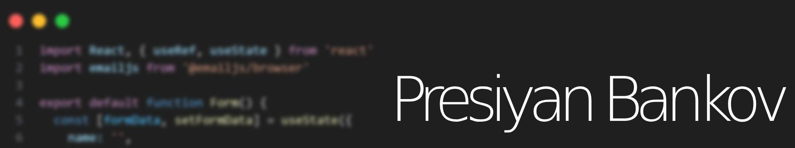

  

## Hi, I'm Presiyan, a Bulgarian Fullstack Developer 👋🏼

- 🔍 Currently looking for new opportunities 
- 🛠️ Working on а personal project 
- 🎓 Studying Computer Science at TU Wien 
- 🤝 Open to collaborating on interesting projects

## Tech Stack 🛠️

<picture>
  <source media="(prefers-color-scheme: dark)" srcset="https://raw.githubusercontent.com/presiyanbankov/presiyanbankov/output/github-snake-dark.svg" />
  <source media="(prefers-color-scheme: light)" srcset="https://raw.githubusercontent.com/presiyanbankov/presiyanbankov/output/github-snake.svg" />
  
</picture>
